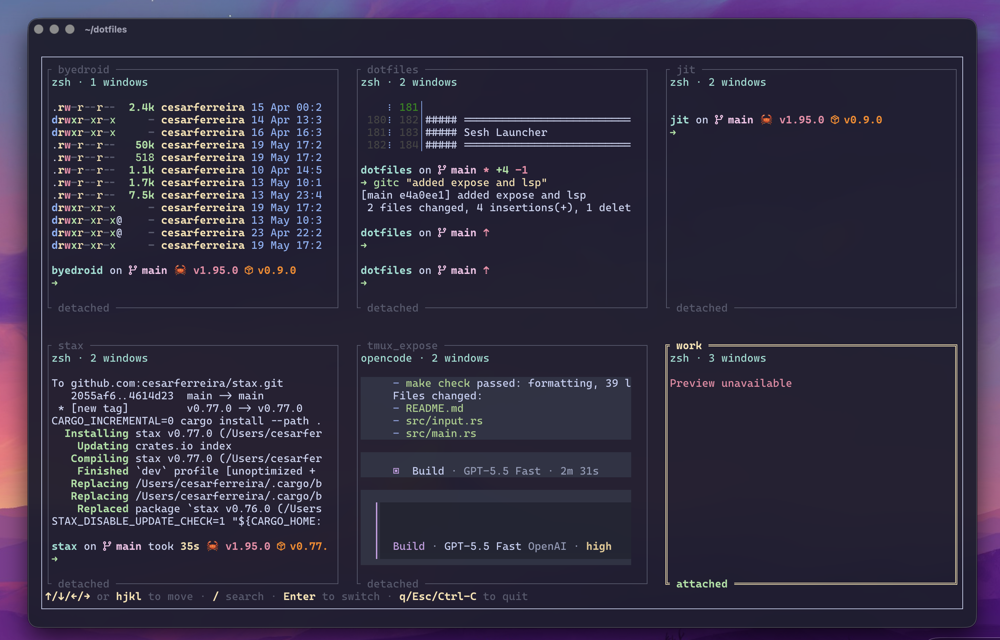

<div align="center">
  <h1>tmux.expose</h1>

  <p><strong>Mission Control-style tmux session switching from a fast terminal UI.</strong></p>

  <p>
    <a href="https://github.com/cesarferreira/tmux.expose/actions/workflows/rust-tests.yml"></a>
    <a href="https://crates.io/crates/tmux-expose"></a>
    <a href="https://github.com/cesarferreira/tmux.expose/releases"></a>
    
  </p>

  <p>
    <a href="#install">Install</a>
    &nbsp;·&nbsp;
    <a href="#quickstart">Quickstart</a>
    &nbsp;·&nbsp;
    <a href="#tmux-plugin">tmux Plugin</a>
    &nbsp;·&nbsp;
    <a href="#configuration">Configuration</a>
  </p>

  <br>

  <!-- Add your screenshot at assets/screenshot.png, then uncomment this block. -->
  <!--  -->
</div>

---

## Why tmux.expose

Switching tmux sessions with a list works, but it gives you names instead of context. **tmux.expose** shows every session as a live text thumbnail so you can jump to the right workspace visually.

- **See before switching.** Browse sessions in a responsive grid with live pane previews.
- **Terminal-native.** A small Rust TUI that runs inside your terminal or a tmux popup.
- **Color-aware previews.** tmux ANSI colors are preserved in thumbnails.
- **Fast keyboard flow.** Move with arrows or `hjkl`, switch with `Enter`, leave with `q` or `Esc`.
- **TPM-ready.** Install it as a tmux plugin and launch with `Alt+e`.

## Install

The shortest path is crates.io:

```bash
cargo install tmux-expose
```

Or install from this repository:

```bash
cargo install --path .
```

Verify the install:

```bash
tmux-expose --version
```

<a id="quickstart"></a>
## Quickstart

Run the UI directly inside tmux:

```bash
tmux-expose
```

Or open it in a tmux popup:

```bash
tmux display-popup -w 100% -h 100% -E "tmux-expose"
```

By default, thumbnails are sized into a balanced grid that fits all sessions on screen. Override the layout when you want larger previews or a fixed grid:

```bash
tmux-expose --thumbnail-width 48
tmux-expose --columns 2
tmux-expose --thumbnail-width 48 --columns 2
```

Refresh interval defaults to 500ms:

```bash
tmux-expose --refresh-interval 500
```

## Controls

| Key | Action |
|---|---|
| `Arrow keys` | Move selection |
| `hjkl` | Move selection outside search |
| `/` | Search sessions by fuzzy name |
| `Backspace` | Edit search query |
| `Esc` while searching | Clear search |
| `Enter` | Switch to selected session |
| `q` / `Esc` / `Ctrl-C` | Quit without switching |

<a id="tmux-plugin"></a>
## tmux Plugin

Install with [TPM](https://github.com/tmux-plugins/tpm):

```tmux
set -g @plugin 'cesarferreira/tmux.expose'
```

Reload tmux config, then press `prefix + I` to install plugins.

The plugin binds `Alt+e` by default:

```tmux
Alt+e
```

It opens:

```bash
tmux display-popup -w 100% -h 100% -E "tmux-expose"
```

## Configuration

Customize the tmux plugin before the `@plugin` line:

```tmux
set -g @tmux-expose-key 'E'
set -g @tmux-expose-key-table 'prefix'
set -g @tmux-expose-width '100%'
set -g @tmux-expose-height '100%'
set -g @tmux-expose-command 'tmux-expose --columns 2'

set -g @plugin 'cesarferreira/tmux.expose'
```

Use a direct binding if you do not use TPM:

```tmux
bind-key -T root M-e display-popup -w 100% -h 100% -E "tmux-expose"
```

## macOS Gesture Integration

Use BetterTouchTool, Hammerspoon, Raycast, or another automation tool to trigger:

```bash
tmux display-popup -w 100% -h 100% -E "tmux-expose"
```

The app itself is terminal-only and does not depend on macOS-specific APIs.

## Development

Before opening a PR, run:

```bash
make check
```

## License

MIT &copy; Cesar Ferreira
