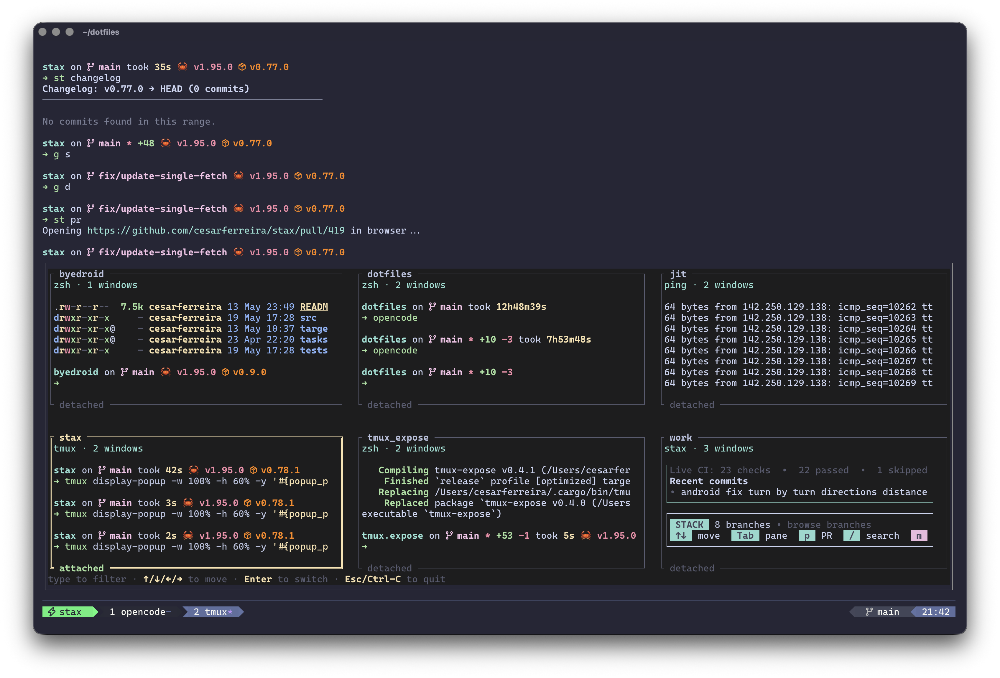

<div align="center">
  <h1>tmux.expose</h1>

  <p><strong>Mission Control-style tmux session switching from a fast terminal UI.</strong></p>

  <p>
    <a href="https://github.com/cesarferreira/tmux.expose/actions/workflows/rust-tests.yml"></a>
    <a href="https://crates.io/crates/tmux-expose"></a>
    
  </p>

  <p>
    <a href="#install">Install</a>
    &nbsp;·&nbsp;
    <a href="#quickstart">Quickstart</a>
    &nbsp;·&nbsp;
    <a href="#tmux-plugin">tmux Plugin</a>
    &nbsp;·&nbsp;
    <a href="#configuration">Configuration</a>
  </p>

  <br>

  
</div>

---

## Why tmux.expose

Switching tmux sessions with a list works, but it gives you names instead of context. **tmux.expose** shows every session as a live text thumbnail so you can jump to the right workspace visually.

- **See before switching.** Browse sessions in a responsive grid with live pane previews.
- **Terminal-native.** A small Rust TUI that runs inside your terminal or a tmux popup.
- **Color-aware previews.** tmux ANSI colors are preserved in thumbnails.
- **Fast keyboard flow.** Move with arrows or `hjkl`, switch with `Enter`, leave with `q` or `Esc`.
- **TPM-ready.** Install it as a tmux plugin and launch with `Alt+e`.

## Install

The shortest path is crates.io:

```bash
cargo install tmux-expose
```

## tmux Plugin

Install with [TPM](https://github.com/tmux-plugins/tpm):

```tmux
set -g @plugin 'cesarferreira/tmux.expose'
```

Reload tmux config, then press `prefix + I` to install plugins.

The plugin binds `Alt+e` by default:

```tmux
Alt+e
```

It opens:

```bash
tmux display-popup -w 100% -h 100% -E "tmux-expose"
```

With the default binding, press `Alt+e` again while tmux.expose is open to close it without switching.


## Configuration

Customize the tmux plugin before the `@plugin` line:

```tmux
set -g @tmux-expose-key 'E'
set -g @tmux-expose-key-table 'prefix'
set -g @tmux-expose-width '100%'
set -g @tmux-expose-height '100%'
set -g @tmux-expose-anchor 'center'
set -g @tmux-expose-style 'bg=colour234'
set -g @tmux-expose-border-style 'fg=colour245'
set -g @tmux-expose-selected-color 'yellow'
set -g @tmux-expose-attached-color 'green'
set -g @tmux-expose-inactive-color 'white'
set -g @tmux-expose-vim-keys 'on'
set -g @tmux-expose-command 'tmux-expose --columns 2'

set -g @plugin 'cesarferreira/tmux.expose'
```

`@tmux-expose-anchor` accepts `center`, `top`, `bottom`, `left`, or `right`. For example,
use `set -g @tmux-expose-anchor 'bottom'` with `set -g @tmux-expose-height '50%'` to show
tmux.expose in the bottom half of the screen.

`@tmux-expose-style` maps to `display-popup -s`, and `@tmux-expose-border-style` maps to
`display-popup -S`.

### Card colors

Each session card is highlighted based on its state. Recolor any of them to match your
theme:

| Option | Highlights | Default |
|---|---|---|
| `@tmux-expose-selected-color` | The card under the cursor (title + border) | `yellow` |
| `@tmux-expose-attached-color` | The session you are currently attached to (title + border) | `green` |
| `@tmux-expose-inactive-color` | Every other card (title only; the border stays dimmed) | `white` |

Values accept a color name (`yellow`, `cyan`, …), a 256-color index (`colour208` or
`208`), or a hex value (`#ff8700`). Omit an option to keep its default.

For example, a [Dracula](https://draculatheme.com/)-flavored setup:

```tmux
set -g @tmux-expose-selected-color '#bd93f9'
set -g @tmux-expose-attached-color '#50fa7b'
set -g @tmux-expose-inactive-color '#6272a4'
```

The same colors are also available as CLI flags when running the binary directly:

```bash
tmux-expose --selected-color '#bd93f9' --attached-color '#50fa7b' --inactive-color '#6272a4'
```

### Vim navigation

Set `@tmux-expose-vim-keys 'on'` (or run `tmux-expose --vim`) to switch the picker to modal
vim keys. It is off by default, leaving the standard type-to-filter behavior unchanged.

When enabled, the picker starts in **normal** mode:

| Key | Action |
|---|---|
| `h` `j` `k` `l` (or arrows) | Move the selection |
| `/` | Enter search mode |
| `Enter` | Switch to the selected session |
| `q` / `Esc` | Quit |

Pressing `/` enters **search** mode, where typing fuzzy-filters as usual (so `h/j/k/l`
become text again); `Esc` returns to normal mode and `Enter` switches.

## Custom Example

This configuration binds tmux.expose to `prefix + s` and opens it as a bottom-anchored popup
using 60% of the screen height:

```tmux
set -g @tmux-expose-key 's'
set -g @tmux-expose-key-table 'prefix'
set -g @tmux-expose-width '100%'
set -g @tmux-expose-height '60%'
set -g @tmux-expose-anchor 'bottom'
set -g @tmux-expose-style 'bg=colour234'
set -g @tmux-expose-border-style 'fg=colour245'

set -g @plugin 'cesarferreira/tmux.expose'
```

<p align="center">
  
</p>

It produces a popup equivalent to:

```bash
tmux display-popup -w 100% -h 60% -y '#{popup_pane_bottom}' -s 'bg=colour234' -S 'fg=colour245' -e TMUX_EXPOSE_TOGGLE_KEY=s -E "tmux-expose"
```


Use a direct binding if you do not use TPM:

```tmux
bind-key -T root M-e display-popup -w 100% -h 100% -e TMUX_EXPOSE_TOGGLE_KEY=M-e -E "tmux-expose"
```

<a id="quickstart"></a>
## Quickstart

Run the UI directly inside tmux:

```bash
tmux-expose
```

Or open it in a tmux popup:

```bash
tmux display-popup -w 100% -h 100% -E "tmux-expose"
```

By default, thumbnails are sized into a balanced grid that fits all sessions on screen. Override the layout when you want larger previews or a fixed grid:

```bash
tmux-expose --thumbnail-width 48
tmux-expose --columns 2
tmux-expose --thumbnail-width 48 --columns 2
```

Refresh interval defaults to 500ms:

```bash
tmux-expose --refresh-interval 500
```

Recolor the card highlights (names, 256-color indices, or hex values are accepted):

```bash
tmux-expose --selected-color cyan --attached-color green --inactive-color white
```

## Controls

| Key | Action |
|---|---|
| `Type` | Filter sessions by fuzzy name |
| `Arrow keys` | Move selection |
| `Mouse click` | Switch to clicked session |
| `Backspace` | Edit search query |
| `Esc` while searching | Clear search |
| `Enter` | Switch to selected session |
| `Esc` / `Ctrl-C` | Quit without switching |

Prefer vim keys? See [Vim navigation](#vim-navigation) for an opt-in `hjkl` mode.

<a id="tmux-plugin"></a>


## macOS Gesture Integration

Use BetterTouchTool, Hammerspoon, Raycast, or another automation tool to trigger:

```bash
tmux display-popup -w 100% -h 100% -E "tmux-expose"
```

The app itself is terminal-only and does not depend on macOS-specific APIs.

## Development

Before opening a PR, run:

```bash
make check
```

## License

MIT &copy; Cesar Ferreira
